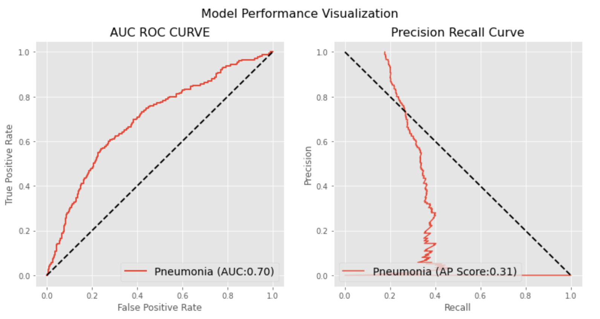
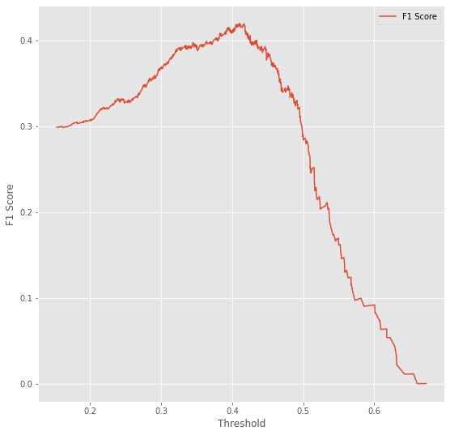
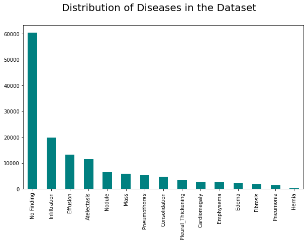
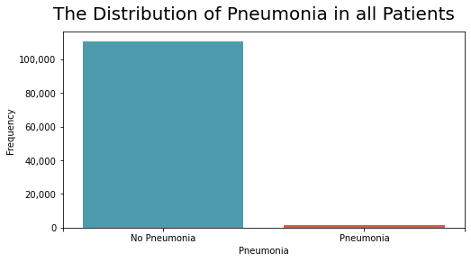
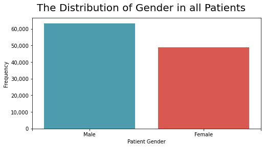
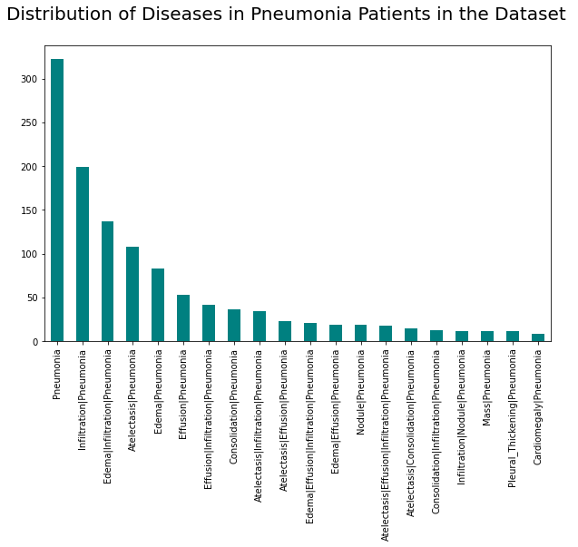
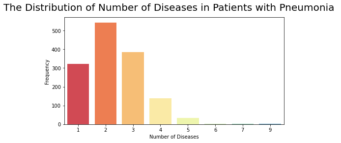
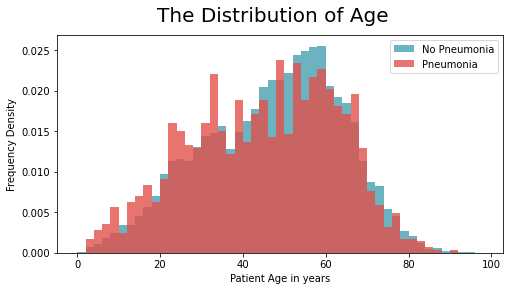
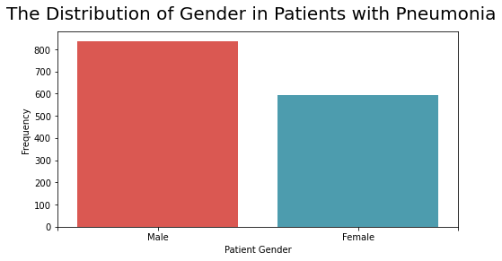
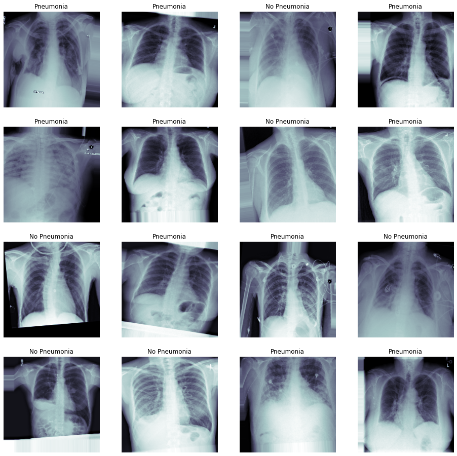

# Pneumonia Detection from Chest X-Rays

### AI for Healthcare Nanodegree Program
**Project 1**
---

# FDA  Submission

**Your Name:** Raghad Alharbi

**Name of your Device:** Deep Pneumo Detector

## Algorithm Description 

### 1. General Information

**Intended Use Statement:** 

This algorithm is intended for use in assisting a radiologist with the detection of the presence of pneumonia in a chest X-rays  screening.

**Indications for Use:** 

This algorithm is indicated for use in screening chest X-Ray studies of pneumonia in men and women of ages 1-95 with posteroanterior (PA) or anteroposterior (AP) views. The algorithm should be integrated into the normal workflow of the diagnostic clinics. The X-Ray images should be available in DICOM format, respecting the HIPAA rules. The data is then sent through your algorithm and it first checks the conditions. If it satisfies the criteria, it makes the prediction. Once the prediction is complete, this data is sent to a radiologist, and then he/she will give the final decision based on his/her independent diagnosis as well as the data supplied by your algorithm.

**Device Limitations:** 

This algorithm is not appropriate to be use in emergency sittings because of its performance based limitations. This algorithm needs a GPU to preforme well.

**Clinical Impact of Performance:** 

The algorithm was designed to have higher F1 score and high recall which means there may be more false positive. This means it is more likely for the algorithm to classify a non-pneumonia x-ray image as having pneumonia. The algorithm can also produce false negative result where xray image with pneumonia may be classified as not having pneumonia, which is not an intended outcome, and can be a life threat if the predition was taken into consideration without any further assessment by a Radiologist.

### 2. Algorithm Design and Function

**Algorithm Flowchart**

**Diagram Steps:**

* Read and Check DICOM files
* Split training and validation datasets
* Rebalance and image augmentation for train set
* Build CNN from a VGG16 base model and some extra layers
* Evaluate CNN performance  
* Set threshold to maximize F1 score
* Predict Pneumonia

**DICOM Checking Steps:**

1. The Algorithm reads in DICOM File.
2. Extracts Patient and picture information.
3. Checks if Modality is 'DX'.
4. Checks if Patient Age is less than 100.
5. Checks if Body Part Examined is 'Chest'.
6. Checks if Patient Position is either 'PA' or 'AP'.

**Preprocessing Steps:**

1. Image is resized to 224 x 224 pixles.
2. Image intensity is normalized.

**CNN Architecture:**

- The base model is a [VGG16](https://keras.io/api/applications/vgg/) model that was pre-trained on Imagenet data. 
- Extra layers has been added to the top of the base model:
    - Flatten
    - Dropout with 30% probability
    - Dense, 1024 units with ReLU activation
    - Dropout Dropout with 30% probability
    - Dense, 512 units with ReLU activation
    - Dropout with 30% probability
    - Dense, 256 units with ReLU activation
    - Dropout with 30% probability
    - Dense, 1 unit with Sigmoid activation

### 3. Algorithm Training

**Parameters:**

- Types of augmentation used during training:
    - rescale=1. / 255.0 
    - horizontal_flip = True 
    - vertical_flip = False 
    - height_shift_range = 0.1
    - width_shift_range =0.1 
    - rotation_range =10 
    - shear_range = 0.1
    - zoom_range=0.1   
- Types of augmentation used during validation:
    - rescale=1. / 255.0
- Batch size:
    - Training set batch size = 128 images
    - Validation set batch size = 1000 Images
- Optimizer learning rate: 1e-4
- Layers of pre-existing architecture that were frozen:
	- The first 17 layers of the VGG16 base model 
- Layers of pre-existing architecture that were fine-tuned: 
	- All layers other than the first 17 layers 
- Layers added to pre-existing architecture:
    - Flatten
    - Dropout with 30% probability
    - Dense, 1024 units with ReLU activation
    - Dropout Dropout with 30% probability
    - Dense, 512 units with ReLU activation
    - Dropout with 30% probability
    - Dense, 256 units with ReLU activation
    - Dropout with 30% probability
    - Dense, 1 unit with Sigmoid activation

**Algorithm training performance visualization:**

**AUC and P-R Curve:**

**Final Threshold and Explanation:**

Threshold of 0.41005385 was chosen based on the best F1 score, which was 0.417910

* Accuracy = 0.727
* Precision = 0.3333333333333333
* Recall    = 0.56
* F1 Score  = 0.41791044776119407
* Sensitivity = 0.56
* Specificity = 0.7624242424242424

**Confusion Matrix:**

### 4. Databases

This NIH Chest X-ray Dataset contains 112,120 X-ray images with disease labels from 30,805 unique patients. The disease labels were created using Natural Language Processing (NLP) to mine the associated radiological reports. The labels include 14 common thoracic pathologies:

* Atelectasis
* Consolidation
* Infiltration
* Pneumothorax
* Edema
* Emphysema
* Fibrosis
* Effusion
* Pneumonia
* Pleural thickening
* Cardiomegaly
* Nodule
* Mass
* Hernia

Some statistics about all patients in the dataset:

**All patients in the dataset:**

The population is highly imbalanced between pneumonia and non-pneumonia cases. There are total of 110689 samples with no pneumonia, and 1431 samples with pneumonia in the dataset. 

The patient population for these images were 1-95 year olds and 56.5% male and 43.5% female. 

Some statistics about Pneumonia patients in the dataset:

**Pneumonia patients in the dataset:**

**Description of Training Dataset:** 

80% of the full dataset was selected to be in the training dataset. There are 2288 images in the train dataset after balancing the two classes.
Prevelance of Pneumonia is 0.5.
Number of  pnuemonia  cases in the train data is 1144.
Number of  non-pneumonia  cases in the train data is 1144.
 
Example of the images in the train dataset after augmentation and their labels:

**Description of Validation Dataset:** 

20% of the full dataset was selected to be in the validation dataset.There are 1716 images in the valid dataset.
Prevelance of Pneumonia is 0.166.
Number of  pnuemonia  cases in the valid data is 286.
Number of  non-pneumonia  cases in the valid data is  1430.

### 5. Ground Truth

To create these labels, the authors used Natural Language Processing to text-mine disease classifications from the associated radiological reports. The labels are expected to be >90% accurate and suitable for weakly-supervised learning. The original radiology reports are not publicly available but you can find more details on the labeling process in this Open Access paper: "ChestX-ray8: Hospital-scale Chest X-ray Database and Benchmarks on Weakly-Supervised Classification and Localization of Common Thorax Diseases." [(Wang et al.)](https://www.nih.gov/news-events/news-releases/nih-clinical-center-provides-one-largest-publicly-available-chest-x-ray-datasets-scientific-community)

### 6. FDA Validation Plan

**Patient Population Description for FDA Validation Dataset:**

The sample population of the FDA validation dataset should digital X-ray images from the chest area that are taken from men and women distributed between the age of 1 and 100 with with posteroanterior (PA) or anteroposterior (AP) views.

**Ground Truth Acquisition Methodology:**

As a silver standard for validating X-ray images,we need at least 3 independent practicing radiologists to create the labels. The final diagnosis is then determined by a voting system across all of the radiologists’ labels for each image. The silver standard method is discribed in the ["CheXNet: Radiologist-Level Pneumonia Detection on Chest X-Rays with Deep Learning" paper](https://arxiv.org/pdf/1711.05225.pdf).

**Algorithm Performance Standard:**

Similar to the CheXNet study, We calculate the algorithm’s F1 score and F1 Scores of the silver standard method produced by the voting of three radiologists' diagnosis. Then, both are compared to determine the performance of the algorithm compared to the radiologists.